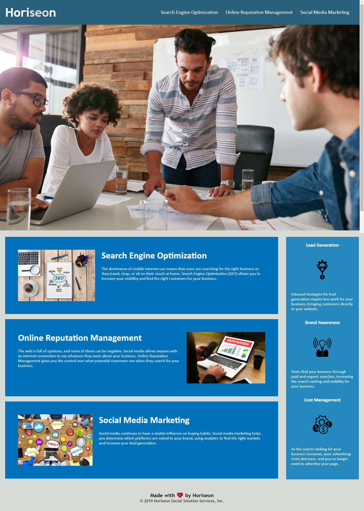

# 01-homework-html-css

In this project we had to refactor the existing code to improve the readability of it. Using semantic HTML elements to make sure that the HTML page is accessible and follows the current accessibility standards. 

- I used semantic HTML elements to replace the div classes that were already on the existing code. 

- On all the image tags I added alt tags to them for accessibility and in case the images don't load for some reason.

- Added in comments in the HTML file to show what each section of code does and what it correlates to on the page.

- Condensed down the CSS selectors and reorganized how the CSS code is laid out semanticly.

- Added in comments in the CSS file to show what every Comment section refers to to the HTML file. 

# Screenshot
 

 

# Deployment Link

Below is the deployment github pages link.

[01-homework-deployment-link](https://itiskchengs.github.io/01-homework-html-css/)